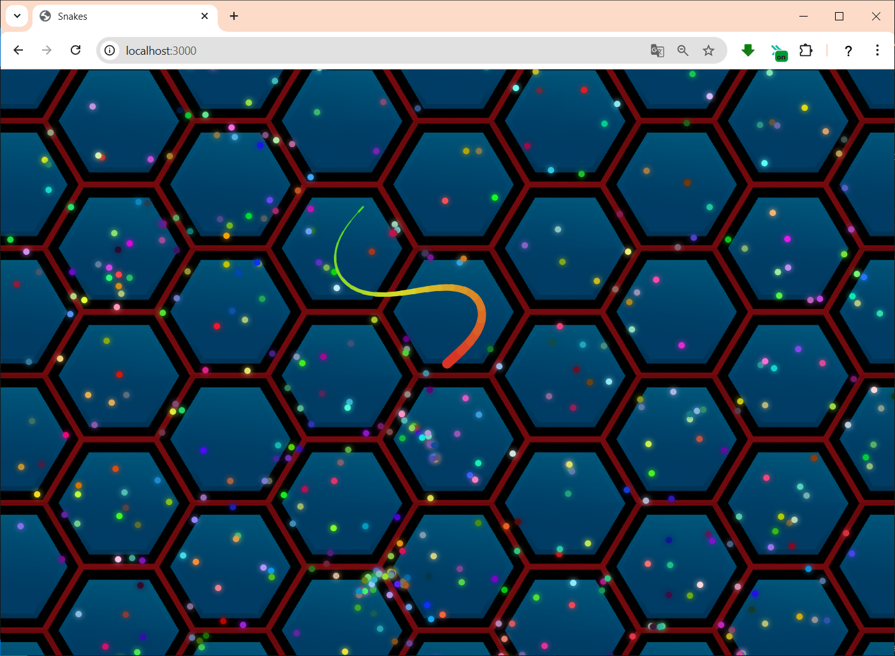

# snake game
Мультиплеєрна браузерна гра (аналог Slither.io)
Мультиплеєрна гра на JavaScript, де гравці керують змійками, змагаються за їжу та уникають зіткнень. 
Гра написана на Node.js із WebSocket-сервером та кастомним рендерингом на Canvas.

## Основний функціонал:
- Реальний час через WebSocket
- Гравці керують напрямком змійки мишкою
- Змійки ростуть при зборі їжі
- Зіткнення між гравцями веде до "смерті"
- Камера слідує за гравцем
- Скіни, ніки
- Оптимізований рендеринг та Spatial Hash для їжі/колізій

